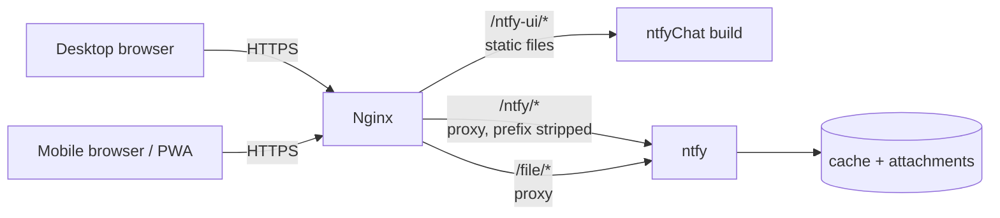

# ntfyChat

A private, self-hosted chat for moving text, screenshots and files between your own devices. It is a single-page web app on top of [ntfy](https://ntfy.sh) — ntfy is the whole backend, this project is the UI that makes it feel like a chat instead of a pub/sub console.

<!-- Screenshot: add a capture of the chat UI (desktop + mobile) here, e.g. docs/screenshot.png -->

The interface is in Chinese (私人传输, "Private Transfer"). The rest of this README is in English.

## What it is

ntfyChat is a static web app (React + Vite, no runtime besides that) that you host next to your own ntfy instance. Any browser — or the installed PWA — opens one fixed URL and talks to every other device that is configured with the same topic.

Typical use: PC ↔ phone, across networks (office Wi-Fi, home, cellular), like a private "file transfer assistant" and cross-device clipboard. Copy text or a URL on the PC, paste a screenshot, drop a file; the phone gets it immediately, and vice versa.

The interface is deliberately a chat — bubbles, device names, images, files, an input box. ntfy concepts such as topics, priorities, tags and ACLs stay inside ntfy.

## Why

| Alternative | What's missing |
| --- | --- |
| AirDrop / LocalSend | same LAN or proximity required |
| Telegram Saved Messages / WeChat file helper | an account, a login on work machines, not self-hosted |
| ntfy's own web UI | works, but it is a pub/sub console (topics, priority, tags) — not a chat |

ntfyChat needs no app install (PWA is optional), no pairing codes, no accounts beyond ntfy's own auth. Configure the same topic on two devices and open the page.

## Features

- Send text, links and multi-line commands (`Enter` sends, `Shift+Enter` adds a newline)
- Paste a screenshot (`Ctrl/Cmd+V`) — it is uploaded as an image automatically
- Send files via picker or drag & drop, multiple files at once
- Inline image preview; other files render as download cards with name and size
- One-tap copy of any message
- Live delivery over SSE plus history replay from the ntfy cache
- Sender shown per message via the device name (ntfy `Title` header)
- Connection status pill (connecting / online / offline / auth error) with automatic reconnect and exponential backoff
- Optimistic sending: pending bubble → confirmed message, with a retry button on failure
- Unread counter while scrolled up
- Light / dark / system theme; mobile layout with safe-area insets
- Installable PWA with an offline app shell
- No analytics, no external fonts, no CDN, no third-party requests

## How it works



The build bakes in `/ntfy-ui/` as its asset base, which gives a fixed URL layout:

| Path | Serves |
| --- | --- |
| `/ntfy` | the chat UI (exact match → `index.html`) |
| `/ntfy-ui/*` | static assets (JS, CSS, icons, manifest) |
| `/ntfy/*` | ntfy API, proxied with the prefix stripped |
| `/file/*` | attachment downloads, proxied to ntfy |

Message flow:

1. **Send** — text goes to `POST {apiBase}/{topic}`, files to `PUT {apiBase}/{topic}?filename=…`, both with the device name in the `Title` header and credentials in `Authorization`.
2. **Optimistic UI** — the bubble appears immediately as a local pending message; the server's JSON response replaces it. Failures show a retry button.
3. **Receive** — history is loaded once via `GET {apiBase}/{topic}/json?poll=1` (a one-shot read of the topic cache), then live messages stream over `GET {apiBase}/{topic}/sse`. The SSE stream is consumed with `fetch` + `ReadableStream` rather than `EventSource`, because `EventSource` cannot send an `Authorization` header.
4. **Dedup** — messages are deduplicated by ntfy message `id`, since history and the live stream can overlap.
5. **Attachments** — fetched with the same auth headers into an in-memory blob. Images preview inline, other files download. Authenticated URLs never end up in the DOM or in storage.

## Relationship with ntfy

ntfy provides everything server-side: message publishing, realtime delivery (SSE), history/cache, attachments and authentication. This project does not modify, vendor or fork ntfy — run the official `binwiederhier/ntfy` image; its own web UI can be disabled (`NTFY_WEB_ROOT: disable`).

What this UI adds on top is the product shape: one topic per device profile, message bubbles, device names, image/file handling, clipboard and a composer — the parts that make ntfy feel like a personal transfer tool.

## Quick start

Requirements: Node.js 20.19+ or 22.12+ (Vite 8's requirement).

```sh
npm install
npm run dev      # UI at http://localhost:5173
npm run build    # static build in dist/
```

In development the default API base `/ntfy` points at the dev server itself, so either

- set the API base in Settings to your ntfy instance directly (e.g. `https://ntfy.example.com` — ntfy sends `Access-Control-Allow-Origin: *` by default), or
- add a Vite dev proxy for `/ntfy` in `vite.config.js`.

Then open Settings and enter: API base, a topic (e.g. `transfer_2026`), a device name, and ntfy credentials (username/password or an access token). Do the same on the other device with the same topic.

## Deployment

The build is pure static files (`dist/`); ntfy runs next to it. The asset base `/ntfy-ui/` is baked in at build time (`base` in `vite.config.js`, plus the manifest/icon links in `index.html` and `public/manifest.json`) — change all three and rebuild if you want a different path.

### 1. Run ntfy

```yaml
# compose.yaml
services:
  ntfy:
    image: binwiederhier/ntfy:latest
    restart: unless-stopped
    command: serve
    ports:
      - "127.0.0.1:2586:80"
    environment:
      NTFY_BASE_URL: https://chat.example.com
      NTFY_BEHIND_PROXY: "true"
      NTFY_CACHE_FILE: /var/lib/ntfy/cache.db
      NTFY_AUTH_FILE: /var/lib/ntfy/auth.db
      NTFY_ATTACHMENT_CACHE_DIR: /var/lib/ntfy/attachments
      NTFY_ATTACHMENT_FILE_SIZE_LIMIT: 250M
      NTFY_ATTACHMENT_TOTAL_SIZE_LIMIT: 2G
      NTFY_AUTH_DEFAULT_ACCESS: deny-all
      NTFY_ENABLE_LOGIN: "true"
      NTFY_WEB_ROOT: disable
    volumes:
      - ./data:/var/lib/ntfy
```

Create a user, grant it access to the topic, and create a token (the CLI prompts for a password):

```sh
docker compose exec ntfy ntfy user add --role=user myname
docker compose exec ntfy ntfy access myname transfer_2026 rw
docker compose exec ntfy ntfy token add --label="phone" myname
```

See the [ntfy docs](https://docs.ntfy.sh/) for the full auth/ACL reference.

### 2. Serve the static build and route with Nginx

Copy `dist/` to `/var/www/ntfy-ui/` (or anywhere your web server can read) and add:

```nginx
# Chat entry: exact matches serve the same index.html.
location = /ntfy {
  root /var/www/ntfy-ui;
  try_files /index.html =404;
}
location = /ntfy/ {
  root /var/www/ntfy-ui;
  try_files /index.html =404;
}

# Static assets (the Vite base).
location ^~ /ntfy-ui/ {
  alias /var/www/ntfy-ui/;
}

# ntfy API — proxy_pass strips the /ntfy/ prefix.
location ^~ /ntfy/ {
  proxy_pass http://127.0.0.1:2586/;
  proxy_http_version 1.1;
  proxy_set_header Host $http_host;
  proxy_set_header X-Forwarded-For $proxy_add_x_forwarded_for;
  proxy_set_header X-Forwarded-Proto $scheme;
  proxy_buffering off;          # keep SSE events flowing
  proxy_read_timeout 3m;        # SSE connections stay open
  client_max_body_size 0;       # size limits come from ntfy
}

# Attachments — ntfy generates /file/ URLs when its base URL is the host root.
location ^~ /file/ {
  proxy_pass http://127.0.0.1:2586;
  proxy_set_header Host $http_host;
  proxy_set_header X-Forwarded-For $proxy_add_x_forwarded_for;
  proxy_set_header X-Forwarded-Proto $scheme;
  proxy_read_timeout 3m;
  client_max_body_size 0;
}
```

Ordering matters: the exact match `= /ntfy` wins over the prefix `^~ /ntfy/`, which is how the UI and the API share the path — every deeper `/ntfy/…` request hits the proxy.

### 3. Open and configure

Open `https://chat.example.com/ntfy` on both devices → gear icon → same API base (`/ntfy`), same topic, different device names, valid credentials. Done.

## Configuration

All configuration happens in the settings sheet (gear icon). There is no config file and no build-time configuration.

| Setting | Meaning | Default |
| --- | --- | --- |
| API base | Base URL of the ntfy API; relative or absolute | `/ntfy` |
| Topic | The shared channel; sanitized to `[A-Za-z0-9_-]`, max 64 chars | — |
| Device name | Shown as the sender on every message (ntfy `Title` header), max 40 chars | — |
| Auth | Basic (username/password) or Bearer access token | Basic |
| Theme | System / light / dark | System |
| Remember | Keep credentials in `localStorage`; otherwise `sessionStorage` | Off |

Non-secret settings persist in `localStorage`. Credentials live in `sessionStorage` by default (cleared when the browser session ends) and in `localStorage` only when "remember" is checked. The UI stores nothing server-side.

## Authentication

- Every request — history, SSE, publishing, attachment fetch — carries the `Authorization` header (Basic or Bearer). Credentials never go into URLs.
- 401/403 stops reconnecting and shows an auth-error state until the credentials are fixed.
- Recommended: per-device access tokens scoped to the topic (`ntfy access user topic rw` / `ro`) instead of one shared password.

## PWA / mobile

- **Install**: the settings sheet shows an install button when the browser fires `beforeinstallprompt`; on iOS use Safari → Share → Add to Home Screen. Runs standalone with maskable icons.
- **Service worker** (`public/sw.js`) caches only the app shell under `/ntfy-ui/` — index, manifest, icons and built assets. It explicitly bypasses `/ntfy/` (API) and `/file/` (attachments): messages, attachments and auth responses are never cached.
- **Offline**: the shell opens, but history, sending and downloads require the server. Nothing is queued for later sending.
- The worker is registered only in production builds.
- Mobile layout: safe-area insets, `100dvh`, 16px inputs (no iOS focus zoom), responsive bubble widths.

## Security

- **No end-to-end encryption.** Messages and attachments are readable by whoever operates the ntfy server. The trust boundary is HTTPS + ntfy auth + server security.
- The topic name is a channel name, not a secret by itself — with `NTFY_AUTH_DEFAULT_ACCESS: deny-all` and per-user ACLs, only authorized credentials can read or publish.
- Message text and file names are rendered as plain text (React text nodes — no HTML injection). Only `http(s)://` URLs are linkified, with `rel="noopener noreferrer"`.
- Credentials: `sessionStorage` by default; `localStorage` only on explicit opt-in ("remember"), which is intended for personal devices — the settings sheet warns against it on shared or office machines.
- Use HTTPS. Basic auth travels as base64 in the `Authorization` header, not as encryption.

## Limitations

- The UI is Chinese-only (zh-CN; strings and date formatting are hardcoded, no i18n yet).
- One topic per profile — no multi-conversation UI.
- No read receipts, typing indicators or peer presence; the status pill reflects your connection, not the other device's.
- No message editing or deletion; history is whatever ntfy's cache retains (configure retention on the ntfy side).
- The offline PWA is shell-only.

## Development

```text
.
├── index.html          # entry, PWA meta, hardcoded /ntfy-ui/ links
├── vite.config.js      # base: "/ntfy-ui/"
├── public/
│   ├── manifest.json   # PWA manifest (scope /ntfy-ui/)
│   ├── sw.js           # app-shell service worker
│   └── icons/
└── src/
    ├── main.jsx        # the whole app: UI, auth, SSE, history, uploads
    └── style.css       # themes and responsive layout
```

- React 19 + Vite, no other runtime dependencies, no state library, no build-time environment variables.
- No automated tests yet.
- The whole application lives in `src/main.jsx` by design — the project is intentionally small.

## License

[MIT](LICENSE). ntfy is a separate service ([Apache-2.0/GPL-2.0](https://github.com/binwiederhier/ntfy/blob/main/LICENSE)) and is not bundled or redistributed here.
