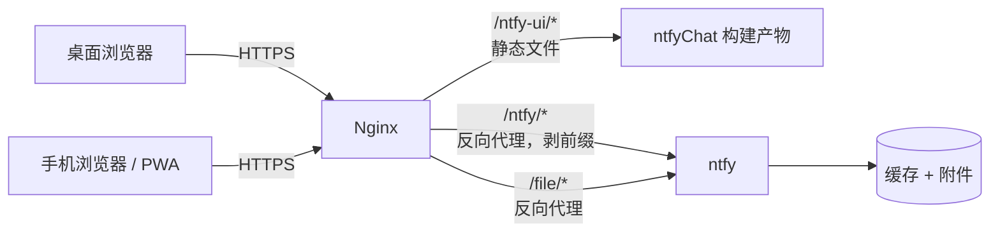

# ntfyChat

在自己的设备之间传输文字、截图和文件的私有自托管聊天工具。它是一个基于 [ntfy](https://ntfy.sh) 的单页 Web 应用——ntfy 承担全部后端，本项目只是把它包装成聊天界面的那一层。

<!-- 截图：在此处放置聊天界面的截图（桌面端 + 移动端），例如 docs/screenshot.png -->

英文文档：[README.md](README.md)

## 这是什么

ntfyChat 是一个静态 Web 应用（React + Vite，除此之外没有运行时），部署在你自己的 ntfy 实例旁边。任何浏览器——或安装后的 PWA——打开同一个固定网址，即可与配置了相同主题（topic）的其他设备互通。

典型用途：电脑 ↔ 手机，跨网络（公司 Wi-Fi、家庭网络、蜂窝网络），类似一个私有的"文件传输助手"与跨设备剪贴板。电脑上复制文字或链接、粘贴截图、拖入文件，手机立刻收到；反之亦然。

界面刻意做成聊天：气泡、设备名、图片、文件、输入框。ntfy 的 Topic、Priority、Tags、ACL 等概念留在 ntfy 内部，不暴露给使用者。

## 为什么

| 替代方案 | 缺什么 |
| --- | --- |
| AirDrop / LocalSend | 需要同一局域网或近距离 |
| Telegram 收藏夹 / 微信文件传输助手 | 需要账号、在办公电脑上登录、无法自托管 |
| ntfy 官方 Web UI | 能用，但它是发布/订阅控制台（主题、优先级、标签），不是聊天 |

ntfyChat 不需要安装 App（PWA 可选）、不需要配对码、除 ntfy 自身的认证外不需要其他账号。两台设备配置同一个主题，打开网页即可使用。

## 功能

- 发送文字、链接和多行命令（`Enter` 发送，`Shift+Enter` 换行）
- 粘贴截图（`Ctrl/Cmd+V`）——自动以图片形式上传
- 通过文件选择器或拖放发送文件，支持一次多个
- 图片内联预览；其他文件显示为带名称和大小的下载卡片
- 任意消息一键复制
- SSE 实时投递 + 从 ntfy 缓存回放历史消息
- 每条消息通过设备名（ntfy `Title` 头）显示发送者
- 连接状态（连接中 / 已连接 / 已断开 / 认证失败），断线自动指数退避重连
- 乐观发送：先显示发送中气泡，成功后替换为正式消息，失败可重试
- 上翻时显示新消息计数
- 浅色 / 深色 / 跟随系统；移动端布局适配安全区
- 可安装 PWA，离线打开应用壳
- 无统计、无外部字体、无 CDN、无第三方请求

## 工作原理



构建时把 `/ntfy-ui/` 固定为资源基路径，形成固定的 URL 布局：

| 路径 | 用途 |
| --- | --- |
| `/ntfy` | 聊天界面（精确匹配 → `index.html`） |
| `/ntfy-ui/*` | 静态资源（JS、CSS、图标、manifest） |
| `/ntfy/*` | ntfy API，反向代理并剥除前缀 |
| `/file/*` | 附件下载，反向代理到 ntfy |

消息流程：

1. **发送**——文字走 `POST {apiBase}/{topic}`，文件走 `PUT {apiBase}/{topic}?filename=…`，两者都以设备名作为 `Title` 头、凭据放在 `Authorization` 头。
2. **乐观 UI**——气泡立即以本地待发送消息的形式出现，服务端返回的 JSON 消息随后替换它。失败显示重试按钮。
3. **接收**——启动时通过 `GET {apiBase}/{topic}/json?poll=1` 一次性读取主题缓存作为历史，随后实时消息经 `GET {apiBase}/{topic}/sse` 流式到达。SSE 流用 `fetch` + `ReadableStream` 消费，而不是 `EventSource`，因为 `EventSource` 无法携带 `Authorization` 头。
4. **去重**——按 ntfy 消息 `id` 去重，因为历史与实时流可能重叠。
5. **附件**——以相同的认证头拉取为内存中的 blob。图片内联预览，其他文件下载。带认证的 URL 不会进入 DOM 或存储。

## 与 ntfy 的关系

ntfy 提供全部服务端能力：消息发布、实时投递（SSE）、历史缓存、附件与认证。本项目没有修改、内置或 fork ntfy——直接运行官方 `binwiederhier/ntfy` 镜像，其自带 Web UI 可以关闭（`NTFY_WEB_ROOT: disable`）。

本项目在其之上增加的是产品形态：每个设备配置一个主题、聊天气泡、设备名、图片/文件处理、剪贴板和输入框——让 ntfy 用起来像一个私人传输工具的那些部分。

## 快速开始

要求 Node.js 20.19+ 或 22.12+（Vite 8 的要求）。

```sh
npm install
npm run dev      # 界面位于 http://localhost:5173
npm run build    # 静态产物输出到 dist/
```

开发模式下默认 API 基地址 `/ntfy` 指向 dev server 自身，因此二选一：

- 在设置里把 API 基地址直接填成你的 ntfy 实例（如 `https://ntfy.example.com`——ntfy 默认发送 `Access-Control-Allow-Origin: *`），或
- 在 `vite.config.js` 中为 `/ntfy` 添加 Vite dev 代理。

然后打开设置，填写：API 基地址、主题（如 `transfer_2026`）、设备名，以及 ntfy 凭据（用户名/密码或 Access Token）。在另一台设备上用相同的主题做同样配置。

## 部署

构建产物是纯静态文件（`dist/`），ntfy 与之并行运行。资源基路径 `/ntfy-ui/` 在构建时写死（`vite.config.js` 的 `base`，以及 `index.html` 和 `public/manifest.json` 中的 manifest/图标链接）——想换路径就改这三处并重新构建。

### 1. 运行 ntfy

```yaml
# compose.yaml
services:
  ntfy:
    image: binwiederhier/ntfy:latest
    restart: unless-stopped
    command: serve
    ports:
      - "127.0.0.1:2586:80"
    environment:
      NTFY_BASE_URL: https://chat.example.com
      NTFY_BEHIND_PROXY: "true"
      NTFY_CACHE_FILE: /var/lib/ntfy/cache.db
      NTFY_AUTH_FILE: /var/lib/ntfy/auth.db
      NTFY_ATTACHMENT_CACHE_DIR: /var/lib/ntfy/attachments
      NTFY_ATTACHMENT_FILE_SIZE_LIMIT: 250M
      NTFY_ATTACHMENT_TOTAL_SIZE_LIMIT: 2G
      NTFY_AUTH_DEFAULT_ACCESS: deny-all
      NTFY_ENABLE_LOGIN: "true"
      NTFY_WEB_ROOT: disable
    volumes:
      - ./data:/var/lib/ntfy
```

创建用户、授予主题访问权限并创建 Token（CLI 会提示输入密码）：

```sh
docker compose exec ntfy ntfy user add --role=user myname
docker compose exec ntfy ntfy access myname transfer_2026 rw
docker compose exec ntfy ntfy token add --label="phone" myname
```

完整的认证/ACL 参考见 [ntfy 文档](https://docs.ntfy.sh/)。

### 2. 托管静态文件并用 Nginx 路由

把 `dist/` 复制到 `/var/www/ntfy-ui/`（或你的 Web 服务器可读的任何位置），并添加：

```nginx
# 聊天入口：两个精确匹配都返回同一个 index.html。
location = /ntfy {
  root /var/www/ntfy-ui;
  try_files /index.html =404;
}
location = /ntfy/ {
  root /var/www/ntfy-ui;
  try_files /index.html =404;
}

# 静态资源（Vite base）。
location ^~ /ntfy-ui/ {
  alias /var/www/ntfy-ui/;
}

# ntfy API —— proxy_pass 会剥除 /ntfy/ 前缀。
location ^~ /ntfy/ {
  proxy_pass http://127.0.0.1:2586/;
  proxy_http_version 1.1;
  proxy_set_header Host $http_host;
  proxy_set_header X-Forwarded-For $proxy_add_x_forwarded_for;
  proxy_set_header X-Forwarded-Proto $scheme;
  proxy_buffering off;          # 让 SSE 事件即时流出
  proxy_read_timeout 3m;        # SSE 连接保持常开
  client_max_body_size 0;       # 大小限制由 ntfy 决定
}

# 附件 —— 当 ntfy 的 base URL 为域名根时，附件 URL 生成在 /file/ 下。
location ^~ /file/ {
  proxy_pass http://127.0.0.1:2586;
  proxy_set_header Host $http_host;
  proxy_set_header X-Forwarded-For $proxy_add_x_forwarded_for;
  proxy_set_header X-Forwarded-Proto $scheme;
  proxy_read_timeout 3m;
  client_max_body_size 0;
}
```

顺序很重要：精确匹配 `= /ntfy` 优先于前缀匹配 `^~ /ntfy/`，界面与 API 因此能共享同一路径——任何更深的 `/ntfy/…` 请求都会进入代理。

### 3. 打开并配置

两台设备都打开 `https://chat.example.com/ntfy` → 右上角齿轮 → 相同的 API 基地址（`/ntfy`）、相同的主题、不同的设备名、有效凭据。完成。

## 配置

所有配置都在设置面板（齿轮图标）里完成，没有配置文件，也没有构建期配置。

| 设置项 | 含义 | 默认值 |
| --- | --- | --- |
| API 基地址 | ntfy API 的基础 URL；相对或绝对 | `/ntfy` |
| 主题 | 共享频道；会清洗为 `[A-Za-z0-9_-]`，最长 64 字符 | — |
| 设备名 | 每条消息显示的发送者（ntfy `Title` 头），最长 40 字符 | — |
| 认证 | Basic（用户名/密码）或 Bearer Access Token | Basic |
| 外观 | 跟随系统 / 浅色 / 深色 | 跟随系统 |
| 记住凭据 | 凭据存入 `localStorage`；否则存 `sessionStorage` | 关 |

非机密设置持久化在 `localStorage`。凭据默认存 `sessionStorage`（浏览器会话结束即清除），只有勾选"记住凭据"才进入 `localStorage`。界面本身不在服务端存储任何东西。

## 认证

- 所有请求——历史、SSE、发布、附件拉取——都携带 `Authorization` 头（Basic 或 Bearer）。凭据从不进入 URL。
- 401/403 会停止重连并显示认证失败状态，直到修正凭据。
- 建议：为每台设备创建限定主题权限的 Access Token（`ntfy access user topic rw` / `ro`），而不是共用同一个密码。

## PWA / 移动端

- **安装**：浏览器触发 `beforeinstallprompt` 时，设置面板会出现安装按钮；iOS 上用 Safari → 分享 → 添加到主屏幕。独立窗口运行，带 maskable 图标。
- **Service Worker**（`public/sw.js`）只缓存 `/ntfy-ui/` 下的应用壳——入口、manifest、图标和构建资源。它显式绕过 `/ntfy/`（API）与 `/file/`（附件）：消息、附件和认证响应从不进缓存。
- **离线**：应用壳能打开，但历史、发送和下载需要服务端。没有离线排队发送。
- Worker 只在生产构建中注册。
- 移动端布局：安全区适配、`100dvh`、16px 输入框（避免 iOS 聚焦缩放）、响应式气泡宽度。

## 安全

- **没有端到端加密。** 消息和附件对 ntfy 服务器的运维者可见。信任边界是 HTTPS + ntfy 认证 + 服务器安全。
- 主题名是频道名，本身不是秘密——配合 `NTFY_AUTH_DEFAULT_ACCESS: deny-all` 和按用户划分的 ACL，只有被授权的凭据才能读取或发布。
- 消息文本和文件名以纯文本渲染（React 文本节点——无 HTML 注入）。只对 `http(s)://` URL 做链接化，并带 `rel="noopener noreferrer"`。
- 凭据：默认 `sessionStorage`；只有显式勾选"记住凭据"才进 `localStorage`，该选项面向个人设备——设置面板会提示不要在共享或办公设备上启用。
- 请使用 HTTPS。Basic 认证在 `Authorization` 头里是 base64 编码，不是加密。

## 局限

- 界面仅中文（zh-CN；文案与日期格式为硬编码，暂无 i18n）。
- 每个配置只有一个主题——没有多会话界面。
- 没有已读回执、输入中提示或对端在线状态；状态指示灯反映的是你自己的连接，不是另一台设备的。
- 不支持消息编辑或删除；历史取决于 ntfy 缓存的保留策略（请在 ntfy 侧配置）。
- 离线 PWA 只有应用壳。

## 开发

```text
.
├── index.html          # 入口、PWA meta、写死的 /ntfy-ui/ 链接
├── vite.config.js      # base: "/ntfy-ui/"
├── public/
│   ├── manifest.json   # PWA manifest（scope /ntfy-ui/）
│   ├── sw.js           # 应用壳 Service Worker
│   └── icons/
└── src/
    ├── main.jsx        # 整个应用：UI、认证、SSE、历史、上传
    └── style.css       # 主题与响应式布局
```

- React 19 + Vite，无其他运行时依赖，无状态管理库，无构建期环境变量。
- 暂无自动化测试。
- 整个应用有意地放在 `src/main.jsx` 一个文件里——项目刻意保持小。

## 许可证

[MIT](LICENSE)。ntfy 是独立的服务（[Apache-2.0/GPL-2.0](https://github.com/binwiederhier/ntfy/blob/main/LICENSE)），本项目不内置或再分发它。
